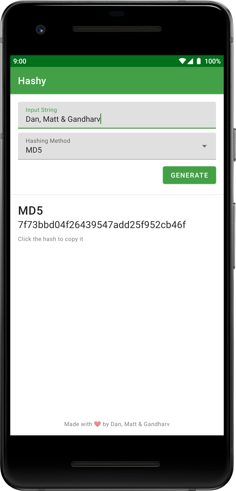
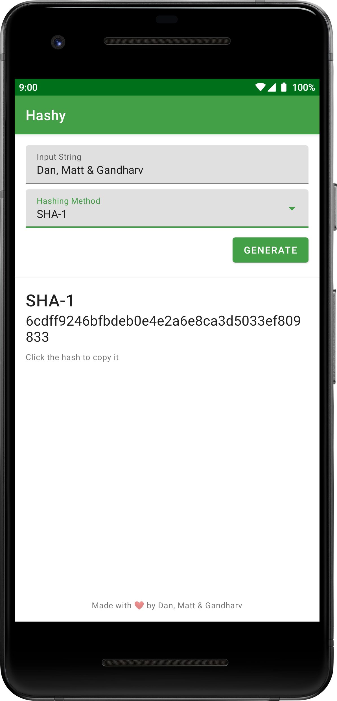

# Hashy

  

* An Android app that generates a hash for a given input string
* You can choose between three hashing algorithms - MD5, SHA1, SHA256

# Technicals

* Written in Java.
* Using Material Theme Components.

# Screenshots

  
  

# Download 

<a href="https://github.com/grewscant/hashy/raw/main/app/release/app-release.apk">Click here to download!</a>

